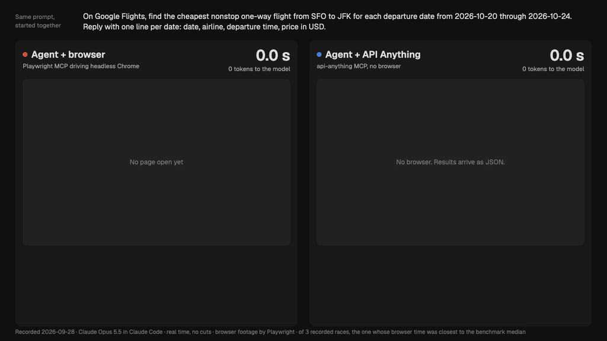
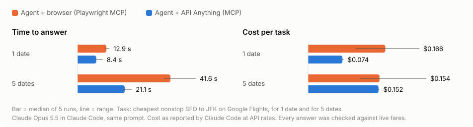

# API Anything

**Teach your agent a website once. After that, it calls the site like an API instead of driving a browser.**

API Anything watches a site's own page make a request and learns which parts of it are your
inputs. It saves the result as an operation. Your agent calls that operation with new inputs
over MCP, the CLI or TypeScript, and gets JSON back over plain HTTP.

[](docs/media/agent-race.mp4)

<sub>Same agent (Claude Opus 5.5), same prompt, started together. Left: it drives headless Chrome
through Playwright MCP. Right: it calls API Anything's Google Flights operation. Shown at 3× speed with no cuts;
the timers show real elapsed time. Recorded 2026-09-28. [MP4](docs/media/agent-race.mp4) · [how it was recorded](bench/README.md#the-recorded-race)</sub>

<picture>
  <source media="(prefers-color-scheme: dark)" srcset="docs/media/agent-benchmark-dark.svg">
  
</picture>

Across 5 runs of each task, the agent using API Anything answered 1.5 to 2× sooner, read about
half as many tokens, and cost the same or less. All 20 answers were correct.
[Method, raw numbers and limits](bench/README.md).

## Quickstart

Needs Node 22.13+, npm and git. The package isn't on npm yet, so install it from GitHub:

```sh
git clone https://github.com/goodnight000/api-anything.git && cd api-anything
npm ci && npm install -g "$(npm pack --silent)"
api-anything call hacker-news search query=sqlite
```

```json
{"ok":true,"class":"ok","tier":1,"data":[{"title":"Hosting SQLite databases on GitHub Pages or any static file hoster","url":"https://phiresky.github.io/blog/2021/hosting-sqlite-databases-on-github-pages/", ...}, ...],"ms":111}
```

`tier: 1` means the call went over plain HTTP with no browser. A failure returns `ok: false`
with a `class`, a `reason` and a `next` step. Google Chrome is needed only to learn new operations
and for browser fallback. Don't use `npm install -g github:...`, because it failed under npm 11.6.2.
[Setup details](docs/QUICKSTART.md).

## Give it to your agent

The MCP server has four tools: `list_sites`, `list_operations`, `call_operation` and `login`.

```sh
codex mcp add api-anything -- api-anything mcp                 # Codex
```

```json
{ "mcpServers": { "api-anything": { "command": "api-anything", "args": ["mcp"] } } }
```

In Claude Code: `/plugin marketplace add goodnight000/api-anything`, then
`/plugin install api-anything@api-anything`.

Over MCP an agent **calls** operations. To **create** one, an agent needs a shell and the
[skill](skills/api-anything/SKILL.md), or you run the CLI yourself.

## Teach it a new site

Give it the page URL with a placeholder, and two example inputs:

```sh
api-anything add hn-demo links \
  --trigger 'https://news.ycombinator.com/from?site={domain}' \
  --example domain=github.com --example2 domain=github.io --match path=/from \
  --html '{"items":"tr.athing","fields":{"title":".titleline > a","url":".titleline > a@href"}}'

api-anything call hn-demo links domain=arxiv.org      # 30 arxiv.org stories, tier 1
```

Headless Chrome loads the page once for each example. The part of the request that changed with
the input becomes a parameter, and the rest is stored as a template. The agent (or you) picks the
request and the fields. API Anything builds the template without an LLM.
[Recorded demos](docs/demos/README.md).

## Map a site from an intent

Tell an agent what you need from a site. The [skill](skills/api-anything/SKILL.md) makes it do
this, in order:

1. Ask about whatever the request leaves unclear.
2. Propose operations and wait for your approval.
3. Scout each page with `capture --outline`. This is a summary of what each request returns, so
   the agent doesn't have to read full responses.
4. Build each operation and check it with an input that wasn't an example.

Goodreads has had no public API since 2020. One run took 6.3 minutes and $1.19. It produced
search, book details, an author's books and reviews:

```sh
api-anything call goodreads searchBooks q=piranesi
api-anything call goodreads getBook bookId=50202953
```

<picture>
  <source media="(prefers-color-scheme: dark)" srcset="docs/media/goodreads-benchmark-dark.svg">
  
</picture>

- **Tested on unseen books.** The test used 30 books that nobody used while building the
  operations. For the 29 books the search found, every checked field matched the page Chrome
  rendered: title, rating, ratings count and pages. All 146 calls went over plain HTTP.
- **Agent comparison.** An agent using the operations answered 5 books in 30.5 s; the browser
  agent took 182.5 s. For one book, it cost a third as much.
- **No agent needed.** A plain script ([`examples/reading-list.mjs`](examples/reading-list.mjs))
  builds the same five-book table in 16 s with no model.

[How it was explored, tested and compared](bench/explore/README.md).

## What's included

22 read operations across 9 sites:

- `google-flights`: search, top flights, price calendar
- `hacker-news`
- `x` and `instagram` profiles
- search on `youtube`, `airbnb` and `amazon`
- `linkedin`: profiles, companies and search, with your own login
- `goodreads`: search, books, author lists and reviews, built by the explorer above

They cover selected features, not whole sites. `api-anything ops <site>` lists parameters and
caveats.

## How it works

- **Learn.** Chrome records the page's requests for two example inputs. The request that
  followed the inputs becomes a template with slots, and cookies and tokens become references to
  a local store.
- **Call.** Fill the slots and send the request with Node's `fetch`. If the site blocks that,
  fetch from inside a Chrome page. As a last resort for reads, run the page itself and read its
  own response.
- **Repair.** If the request stops working (a rotated id, a moved field), re-learn it and save
  the new version only after a replay succeeds. Otherwise the call returns an error, not
  someone else's data.

[Details](docs/REFERENCE.md#replay-fallback-and-repair) · [design](docs/DESIGN.md)

## Limits

- It is a local tool, not a hosted API. It uses your machine, your network and your sessions.
- It knows only the operations it was taught. It doesn't support every feature of every site.
- Repair can fail. There is no CAPTCHA solving, and if a site challenges real Chrome, you have
  to clear the challenge by hand.
- No write operations are bundled. LinkedIn messaging isn't bundled and hasn't been tested
  against LinkedIn. Writes are tested only against a local fixture, and they need
  `--allow-writes`. An HTTP 2xx doesn't prove a message was delivered.
- Credentials stay in `~/.api-anything`, and specs hold references, never values. Read each
  site's terms: you are responsible for how you use it.

[All limits](docs/REFERENCE.md#status-and-known-limits)

## Docs

[Benchmark](bench/README.md) · [Demos](docs/demos/README.md) · [Setup for agents](docs/QUICKSTART.md) ·
[Reference](docs/REFERENCE.md) · [Design](docs/DESIGN.md) · [Release checks](docs/RELEASE-READINESS.md) ·
[Contributing](CONTRIBUTING.md)

MIT licensed.
