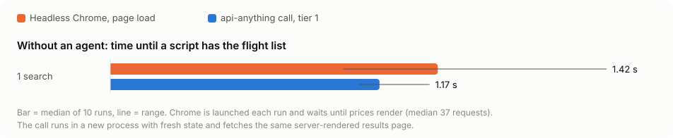

# Benchmark: an agent with a browser vs the same agent with API Anything

One Claude Code agent gets the same prompt twice. In one run it has only a browser (Playwright
MCP on headless Chrome). In the other it has only API Anything's MCP server with the bundled
`google-flights` operations. The same model, settings and prompt are used in both, with fresh
state for every trial. Runs alternate between the two setups and were measured on 2026-09-28
on one Mac.

| | |
|---|---|
| Model | `claude-opus-5-5` through `claude -p`. Your hooks, CLAUDE.md and other MCP servers are not loaded (`--setting-sources project --strict-mcp-config`), and built-in tools are off (`--tools ""`). |
| Browser setup | `@playwright/mcp@0.0.82 --isolated`, headless Google Chrome, 1280×800 |
| API Anything setup | `api-anything mcp` from this checkout, empty `API_ANYTHING_HOME`, bundled specs only |
| Task `flights-1` | "On Google Flights, find the cheapest nonstop one-way flight from SFO to JFK departing 2026-10-20. Reply with one line: airline, departure time, price in USD." |
| Task `flights-5` | The same for each departure date from 2026-10-20 through 2026-10-24, one line per date |
| Time | Wall time from starting `claude` until it exits |
| Cost | `total_cost_usd` as reported by Claude Code, at API list prices including prompt caching |
| Correct | Right after each trial, a snapshot of Google's top and other flight lists is taken. Each date's quoted price must equal the cheapest nonstop fare in that snapshot. Several flights often tie on price, so the airline isn't graded. |

## Results

Median of 5 trials each. Ranges are in brackets.

| task | setup | correct | time | cost | tokens to the model |
|---|---|---|---|---|---|
| 1 date | browser | 5/5 | 12.9 s (12.2–14.3) | $0.166 (0.102–0.239) | 46.7k |
| 1 date | API Anything | 5/5 | 8.4 s (8.1–11.3) | $0.074 (0.073–0.077) | 21.3k |
| 5 dates | browser | 5/5 | 41.6 s (38.7–52.9) | $0.154 (0.111–0.254) | 55.6k |
| 5 dates | API Anything | 5/5 | 21.1 s (20.5–24.3) | $0.152 (0.151–0.154) | 28.6k |

With API Anything the agent answered in half to two-thirds of the time and read about half as
many tokens. Its time and cost barely varied between trials. On the single-date task it cost 55%
less. On the five-date task the cost was the same: the browser agent wrote one Playwright script
that visited all five dates, while the API agent made ten small calls.

Without an agent, getting the flight list took a median of 1.42 s with a script driving
headless Chrome (about 37 requests) and 1.17 s with `api-anything call` (10 runs each,
[`transport.mjs`](transport.mjs)). Google Flights renders its results on the server, so the
operation fetches the same page the browser loads. On this site, the difference is structured
JSON, not transport speed.



## Before and after 0.1.0's output changes

The first batch, run the same day with 0.1.0's output, showed API Anything costing **more** on
the five-date task: a median of $0.209 against $0.139. Its tool results were verbose. Each
flight carried Google's full stop tuples (airport names, cities), and every result repeated its
field names in every item. Two changes followed, and every trial was run again:

- `google-flights` `search` and `top` return `via` (stop airport codes) instead of the raw stop
  tuples, and drop `departureDate`, which always equals the requested date.
- MCP `call_operation` sends a list of records as `{columns, rows}`, so each field name appears
  once. On a real search result this halved the JSON (3,247 → 1,517 characters).

| task | setup | 0.1.0 time | 0.1.0 cost | now time | now cost |
|---|---|---|---|---|---|
| 1 date | API Anything | 8.6 s | $0.087 | 8.4 s | $0.074 |
| 5 dates | API Anything | 20.8 s | $0.209 | 21.1 s | $0.152 |
| 1 date | browser | 14.8 s | $0.164 | 12.9 s | $0.166 |
| 5 dates | browser | 42.5 s (one run 140 s) | $0.139 | 41.6 s | $0.154 |

The 0.1.0 batch wasn't graded for correctness. Its truth snapshots were taken only before and
after the batch, and the Oct 22 fare changed from $309 to $315 during it. Raw summaries:
[v0.1.0/summary.json](results/v0.1.0/summary.json).

## The recorded race

[`docs/media/agent-race.mp4`](../docs/media/agent-race.mp4) shows both agents started at the
same moment on `flights-5`, played at 3× speed. Its timers show real elapsed time. The browser footage is Playwright's own recording of that agent's
page, and everything else is drawn from the two runs' event logs
([`video/timeline.json`](video/timeline.json)). An earlier attempt failed before the browser
opened, because Playwright's ffmpeg wasn't installed. After that, three races were recorded,
with browser times of 88.7 s, 51.5 s and 51.1 s. The video uses the one closest to the benchmark median, which is the
third. In that race, API Anything finished in 23.0 s for $0.150 and the browser agent in 51.1 s
for $0.135. Both got every date right. Running both agents at once shares one machine and
network, so the benchmark numbers come from runs made one at a time. The footage starts when the
browser agent's first tool call does. Playwright stops adding frames once the page goes idle, so
the last frame is held while the agent writes its answer.

## Reproduce

Requires the `claude` CLI (signed in), Google Chrome, ffmpeg, and `npm ci && npm run build`.
It costs roughly $3 in model usage at API rates.

```sh
node bench/run-agents.mjs --trials 5 > bench/results/trials.jsonl   # about 15 min
node bench/transport.mjs --trials 10 > bench/results/transport.jsonl
node bench/charts.mjs                                             # summary.json and docs/media/*.svg
node bench/video/record-race.mjs && mv bench/video/raw bench/video/raw-run1
node bench/video/render.mjs raw-run1                              # docs/media/agent-race.*
```

Raw event logs (`bench/results/raw`, `bench/video/raw-*`) stay local. They hold full tool
results and page text.

## Limits of this benchmark

- One site, one model, one browser tool, a few dozen runs, on one day. Google Flights is a
  server-rendered page. On sites where the browser must run a heavy client-side app before the
  data appears, the gap in time without an agent would differ, but this benchmark didn't
  measure that.
- The browser agent was capable. It used `browser_evaluate` and wrote Playwright scripts
  instead of reading full page snapshots. A weaker model or a snapshot-only browser tool would
  cost more, and that wasn't measured either.
- Cost covers model usage only. Running Chrome costs memory and CPU; API Anything's tier-1 call
  doesn't start a browser.
- Prices are live. Grading uses a snapshot taken seconds after each trial, not during it.
