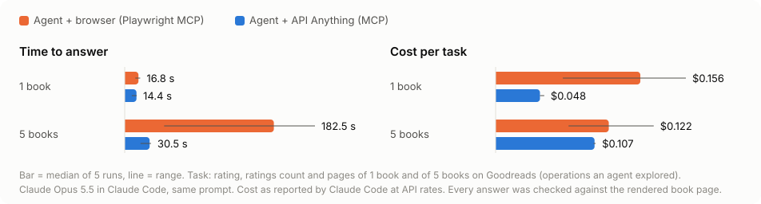

# Site explorer: turning Goodreads into an API, and checking it

Goodreads closed its public API in 2020. This folder records a Claude Code agent turning Goodreads
into callable operations from a stated intent, using the api-anything skill. It then checks
whether those operations work for inputs nobody used while building them, and whether they save
anything compared with an agent that drives a browser. All runs happened on 2026-09-28 on one Mac,
with `claude-opus-5-5`. Everything was read-only.

## The explorer

The explorer isn't a crawler. It's a way of working, written into the
[skill](../../skills/api-anything/SKILL.md#turning-a-site-into-an-api-intent-first), plus one
deterministic tool:

1. **Clarify the intent.** Which questions will the user ask, which inputs change, which fields
   do they need back, is it read-only, does it need login? It asks only when the request doesn't
   say.
2. **Propose operations** as `name(inputs) -> fields`, and wait for approval.
3. **Scout** with `api-anything capture <page> --outline`. For the top candidate requests, the
   scout reports:
   - where the example value sits;
   - a suggested extract path and fields with sample values;
   - JSON the page embeds, with a ready `--embedded` regex;
   - a repeated HTML list as a ready `--html` recipe;
   - labelled fields on a detail page.

   The scout ([`src/outline.ts`](../../src/outline.ts)) has no site-specific rules and uses no
   LLM.
4. **Teach and verify** each operation. Call it with an input that wasn't an example, and compare
   the result with the page.
5. **Report** what was built, what it was checked with, and what isn't covered.

## The runs

The prompts are in this folder. I wrote the user's intent
([goodreads-intent.md](goodreads-intent.md)): four questions a reading assistant would ask.
[run-explore.mjs](run-explore.mjs) gives the agent the skill and a shell that may only run
`api-anything` and `jq`, with a fresh state directory. It records every command.

| run | prompt | time | cost | commands | result |
|---|---|---|---|---|---|
| [vague](results/vague/report.md) | "Turn Goodreads into an API for me." | 14 s | $0.10 | 1 (`sites`) | Asked 3 intent questions, proposed a default set of operations, and stopped. It captured nothing. |
| [run 1](results/goodreads-run1/report.md) | the stated intent | 7.0 min | $1.17 | 47 | 3 of 4 operations. Search returned 1 result, reviews had no stars, and the author list wasn't saved. Its report named the product bugs behind each gap. |
| [run 2](results/goodreads/report.md) | the same, after fixing those bugs | 6.3 min | $1.19 | 44: 7 captures, 25 inspects, 7 adds, 4 calls | 5 operations covering all 4 questions. `verify` passes. |

The bugs run 1 found are generic engine bugs, not Goodreads quirks. All are fixed with
regression tests:

- A response that is itself a list was learned as its first item, and `--extract '[*]'` was
  misread as drift.
- `add` blamed a bot wall on an ad's reCAPTCHA iframe. That hid the real error (an example ID
  shorter than 3 characters).
- CLI errors kept only their first line.
- `--pick` split regexes on commas.
- HTML fields couldn't return a list. A book's genres became `genre1`…`genre7`. Fields now
  accept `all:`.
- The scout didn't show values held only in `aria-label`, such as review stars.

The reliability check below found one more:

- A site-wide API key learned as a session value wasn't refreshed on a fresh install when the
  operation's page asks for a different record. Reviews failed on 30 of 30 books until it was
  fixed.

What run 2 built ([goodreads.json](results/goodreads/goodreads.json), bundled as
[`sites/goodreads.json`](../../sites/goodreads.json) with notes):

| op | input | returns | source the agent chose |
|---|---|---|---|
| `searchBooks` | `q` | top 5: bookId, title, author, authorId, avgRating, ratingsCount | Goodreads's legacy autocomplete JSON. The agent knew this URL. The scout's search-box capture found the site's current GraphQL suggestions request, which the agent didn't use. |
| `getBook` | `bookId` | title, author, avgRating, ratingsCount, pages, firstPublished, genres (list), description | the book page's HTML, with the scout's labelled fields |
| `authorBooks` | `authorId` | up to 30 books with ratings | the author list page's HTML table |
| `getWorkId` | `bookId` | workId | JSON embedded in the book page |
| `getReviews` | `workId` | reviewer, rating, text | the page's own GraphQL request, sent with the site's API key |

The scout reduced reading but didn't replace it: run 2 still ran 25 `inspect` commands.

## Does it work? 30 books nobody used while building it

[reliability.mjs](reliability.mjs) runs each book through search → details → author's books →
reviews (via `getWorkId`), using the operations through the library. It then opens the same book
page in real Chrome ([truth.mjs](truth.mjs)) and compares what a person sees.

Search by title, then choose the result by the book's author with the most ratings
([reliability-title.jsonl](results/goodreads/reliability-title.jsonl)):

| check | result |
|---|---|
| search answered | 30/30 |
| search's top result is the rendered search page's top result | 29/30 |
| the intended book was among the results | 29/30. The miss is my harness: Goodreads lists "Mary Wollstonecraft Shelley", which my author match didn't accept. |
| `getBook` title, rating, ratings count (within 0.5%) and pages all equal the rendered page | 29/29 |
| `getWorkId` then `getReviews` returned reviews with text | 29/29 |
| `authorBooks` answered and includes the book | 29/29 |
| transport | 146 of 146 calls at tier 1 (HTTP, no browser), median 1.0 s per call |

Searching "title author" instead ([reliability-title-author.jsonl](results/goodreads/reliability-title-author.jsonl))
found the intended book for only 17 of 30. Goodreads's own search page ranks summaries and study
guides first for those queries: the operation's top result matched the rendered page's top
result 29 of 30 times. That's the site's ranking, not a replay error. The site notes tell callers
to search by title.

## Is it worth it? Browser agent vs API Anything agent

The same prompt went to the same model with only Playwright MCP (headless Chrome with a normal
user agent, since Goodreads serves headless Chrome's default an empty page), or only API
Anything's MCP server seeded with the explored spec. Each task ran 5 times per setup, and each
answer was graded against the rendered book pages right after the trial
([../results/goodreads](../results/goodreads/summary.json)).



| task | setup | correct | time (median, range) | cost (median) | tokens |
|---|---|---|---|---|---|
| 1 book | browser | 5/5 | 16.8 s (13.0–19.0) | $0.156 | 68k |
| 1 book | API Anything | 5/5 | 14.4 s (8.7–14.7) | $0.048 | 21k |
| 5 books | browser | 5/5 | 182.5 s (48.2–232.8) | $0.122 | 74k |
| 5 books | API Anything | 5/5 | 30.5 s (19.4–32.2) | $0.107 | 29k |

On five books the browser agent often spent minutes getting past search results full of study
guides. API Anything's runs barely varied.

**Without an agent.** [`examples/reading-list.mjs`](../../examples/reading-list.mjs) is plain code
that chains `searchBooks`, `getBook` and `authorBooks`. For the same five books it made 15 calls,
all at tier 1, in 16.4 s, with no browser and no model:

```text
| book | author | rating | ratings | pages | genres | author's best other book |
| Circe | Madeline Miller | 4.22 | 1,481,200 | 393 | Fantasy, Mythology, Fiction | The Song of Achilles (4.30) |
| The Name of the Wind | Patrick Rothfuss | 4.52 | 1,121,199 | 662 | Fantasy, Fiction, Epic Fantasy | The Wise Man's Fear (The Kingkiller Chronicle, #2) (4.55) |
| Educated | Tara Westover | 4.46 | 1,979,498 | 352 | Nonfiction, Memoir, Book Club |  |
| Pachinko | Min Jin Lee | 4.34 | 695,740 | 496 | Historical Fiction, Fiction, Book Club | The Great Gatsby (3.93) |
| The Martian | Andy Weir | 4.42 | 1,383,715 | 369 | Science Fiction, Fiction, Audiobook | Project Hail Mary (4.51) |
```

The data is Goodreads's own: Min Jin Lee's author page includes an edition of *The Great Gatsby*
she contributed to. A script still needs judgment about what it's reading.

**Break-even.** Exploring cost $1.19 once. Model cost only:

- Against a browser agent looking up single books ($0.108 saved each), exploration pays for itself
  after about 11 lookups.
- Against the five-book task done by an agent both ways ($0.015 saved each), it takes about 80
  tasks. Each of those also finishes about 2.5 minutes sooner.
- Against the five-book task run as the no-model script ($0.122 saved each), about 10 runs.

## Reproduce

```sh
npm ci && npm run build
node bench/explore/run-explore.mjs --name goodreads --prompt bench/explore/goodreads-intent.md --site goodreads
node bench/explore/reliability.mjs --spec bench/explore/results/goodreads/goodreads.json \
  --ops "$(cat bench/explore/results/goodreads/ops-map.json)" --title-only > reliability-title.jsonl
node bench/run-agents.mjs --tasks goodreads-1,goodreads-5 --seed bench/explore/results/goodreads/goodreads.json \
  --out bench/results/goodreads > bench/results/goodreads/trials.jsonl
node bench/charts.mjs goodreads
node examples/reading-list.mjs "Circe by Madeline Miller" "Piranesi by Susanna Clarke"
```

Raw agent events and the explorer's state directory stay local (`bench/explore/state`,
`bench/results/**/raw`).

## What this doesn't show

- **One site, one day.** Goodreads's pages and endpoints will change. Repair is designed for that
  but wasn't exercised here. `getReviews` can't be repaired automatically, because its page is
  fixed to one book.
- **Partial coverage.** Only the operations asked for: page 1 of every list, and no shelves or
  anything that needs an account.
- **A skilled agent.** The explorer was Opus with the skill, and it also used what it already
  knew about Goodreads. A weaker model may explore worse. Exploring still meant 44 commands and
  25 `inspect` reads.
- **Data comes as the site shows it.** Numbers are strings with commas, and review text is HTML.
- **I wrote the intent.** Nobody else supplied it, and the grading harness matches authors by
  name, which cost one miss.
