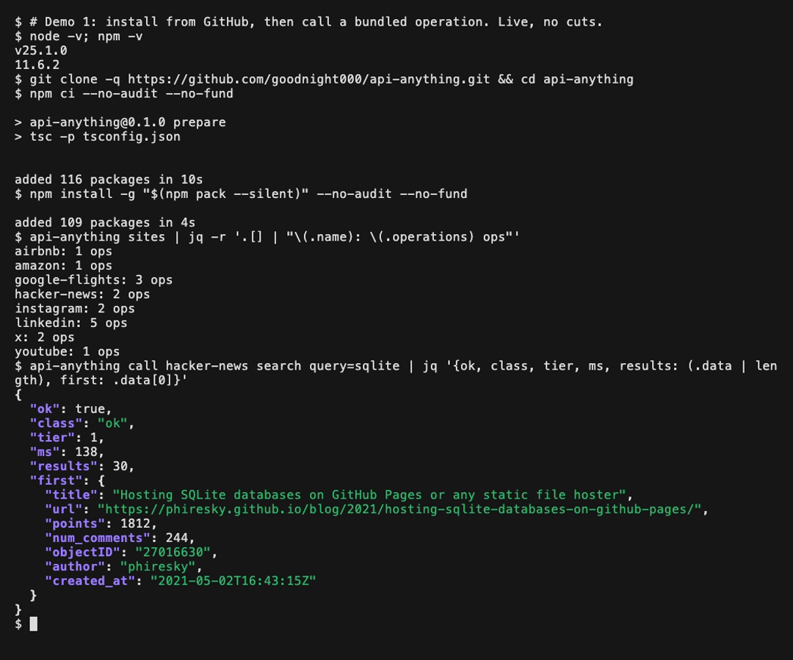
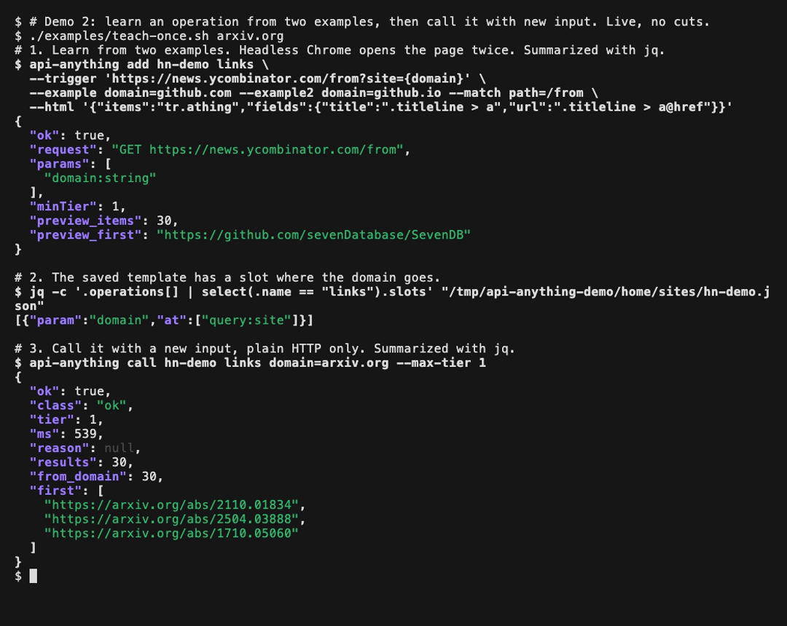
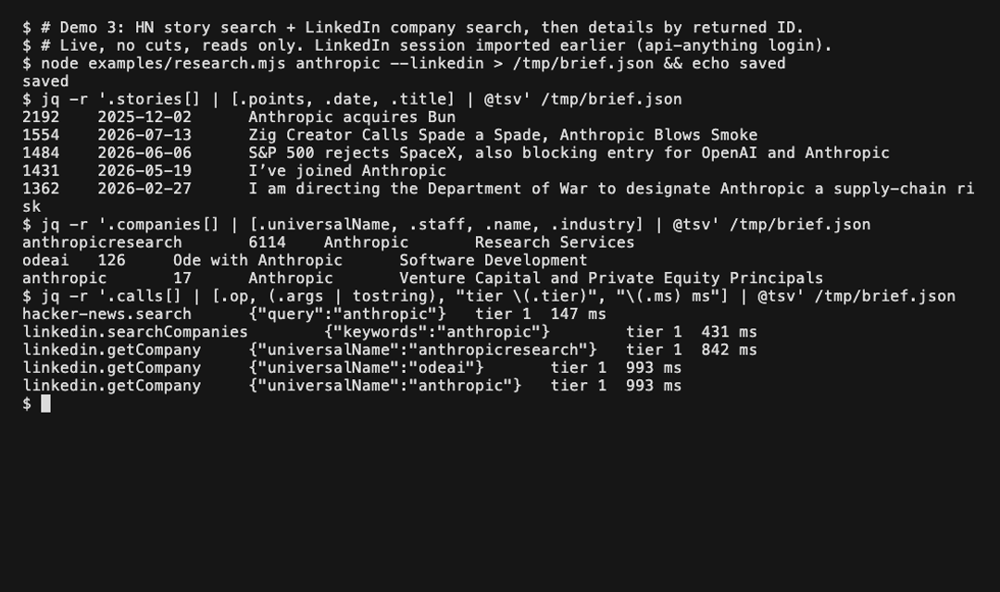

# Demos

Three recordings made on 2026-09-27 on macOS with Node 25.1.0 and npm 11.6.2, from commit
`56839a7` plus the example scripts on this branch. Each ran live with no cuts and no speed-up.
[VHS](https://github.com/charmbracelet/vhs) typed the commands. The `.txt` file next to each GIF
is the terminal text from the same run, and `research-brief.json` is the file demo 3 wrote.
These are dated results. They do not show that a site answers the same way today.

Before each recording, an off-screen step pointed all state at `/tmp/api-anything-demo`: the
`API_ANYTHING_HOME` directory, the npm global prefix and, for demo 1, a new npm cache. The
`.tape` files contain that step. Demo 3 also copied an existing LinkedIn session, created with
`api-anything login linkedin`, into that directory. No cookie values, account names or raw captures
appear in the recordings or in this repository.

`jq` only formats the output below. Without it, the commands print one line of JSON.

## 1. First successful call

[](first-call.gif)

[Recording](first-call.gif) (33 s) · [transcript](first-call.txt) · [tape](first-call.tape)

```sh
git clone -q https://github.com/goodnight000/api-anything.git && cd api-anything
npm ci --no-audit --no-fund
npm install -g "$(npm pack --silent)" --no-audit --no-fund
api-anything sites | jq -r '.[] | "\(.name): \(.operations) ops"'
api-anything call hacker-news search query=sqlite | jq '{ok, class, tier, ms, results: (.data | length), first: .data[0]}'
```

```json
{
  "ok": true,
  "class": "ok",
  "tier": 1,
  "ms": 138,
  "results": 30,
  "first": {
    "title": "Hosting SQLite databases on GitHub Pages or any static file hoster",
    "url": "https://phiresky.github.io/blog/2021/hosting-sqlite-databases-on-github-pages/",
    "points": 1812,
    "num_comments": 244,
    "objectID": "27016630",
    "author": "phiresky",
    "created_at": "2021-05-02T16:43:15Z"
  }
}
```

The run used an empty npm cache: `npm ci` took 10 s and the global install 4 s. This call needs
neither Chrome nor an account. `npx -y github:goodnight000/api-anything call hacker-news search
query=sqlite` also worked with an empty cache, taking about 10 s. It was run without recording.

## 2. Teach once, call with new inputs

[](teach-once.gif)

[Recording](teach-once.gif) (25 s) · [transcript](teach-once.txt) · [tape](teach-once.tape) ·
[script](../../examples/teach-once.sh)

Run from the clone, with Chrome installed:

```sh
./examples/teach-once.sh arxiv.org
```

The script runs three commands and prints each before it runs:

1. `api-anything add` loads `news.ycombinator.com/from?site=github.com`, then `?site=github.io`,
   in headless Chrome. It saves `hn-demo.links`, with one parameter, `domain`.
2. `jq` reads the saved spec. The domain is stored as a slot, `{"param":"domain","at":["query:site"]}`,
   so later calls fill it in. They do not replay the github.com answer.
3. `api-anything call hn-demo links domain=arxiv.org --max-tier 1` calls the operation with a
   domain that was not used during learning. `--max-tier 1` allows only plain HTTP, with no
   browser.

```json
{
  "ok": true,
  "class": "ok",
  "tier": 1,
  "ms": 539,
  "reason": null,
  "results": 30,
  "from_domain": 30,
  "first": [
    "https://arxiv.org/abs/2110.01834",
    "https://arxiv.org/abs/2504.03888",
    "https://arxiv.org/abs/1710.05060"
  ]
}
```

`from_domain` counts the results whose URL host is the requested domain: 30 of 30. The script
exits nonzero if any result comes from another host. The recording then uses
[`examples/mcp-call.mjs`](../../examples/mcp-call.mjs), a scripted MCP client, to call the same
operation through `api-anything mcp` with `domain=nature.com`. That call returned 30 results
through tier 1, and the three shown are nature.com articles. An LLM agent makes the same
`call_operation` request, but the recording shows a script, not an agent.

## 3. Research workflow: stories plus LinkedIn companies

[](research.gif)

[Recording](research.gif) (20 s) · [transcript](research.txt) · [tape](research.tape) ·
[script](../../examples/research.mjs) · [full output](research-brief.json)

```sh
api-anything login linkedin          # once: imports your existing browser session
node examples/research.mjs anthropic --linkedin > brief.json
```

[`examples/research.mjs`](../../examples/research.mjs) calls `hacker-news.search`, then
`linkedin.searchCompanies`. It passes the `universalName` of each of the first three company
results to `linkedin.getCompany`. It stops with an error if any call fails or is truncated. The
output is a short brief with stories, companies, and a log of each call. From the transcript, with
some story lines left out:

```text
$ jq -r '.stories[] | [.points, .date, .title] | @tsv' /tmp/brief.json
2192    2025-12-02      Anthropic acquires Bun
1554    2026-07-13      Zig Creator Calls Spade a Spade, Anthropic Blows Smoke
...
$ jq -r '.companies[] | [.universalName, .staff, .name, .industry] | @tsv' /tmp/brief.json
anthropicresearch       6114    Anthropic       Research Services
odeai   126     Ode with Anthropic      Software Development
anthropic       17      Anthropic       Venture Capital and Private Equity Principals
$ jq -r '.calls[] | [.op, (.args | tostring), "tier \(.tier)", "\(.ms) ms"] | @tsv' /tmp/brief.json
hacker-news.search      {"query":"anthropic"}   tier 1  147 ms
linkedin.searchCompanies        {"keywords":"anthropic"}        tier 1  431 ms
linkedin.getCompany     {"universalName":"anthropicresearch"}   tier 1  842 ms
linkedin.getCompany     {"universalName":"odeai"}       tier 1  993 ms
linkedin.getCompany     {"universalName":"anthropic"}   tier 1  993 ms
```

The third result is a different company with the same name. The search returns what LinkedIn
returns, and a person or agent still decides which result is relevant. Every call is a read. The
script sends no messages or connection requests. Without `--linkedin`, it needs no account.
Without a LinkedIn session, the script stops at `searchCompanies` with `class: "auth"`
("HTTP 403 with login markers") and `next: ask the user to run: api-anything login linkedin`.

## Re-recording

```sh
brew install vhs              # also needs jq, Google Chrome and network access
docs/demos/record.sh          # or: docs/demos/record.sh teach-once
```

The recordings reuse demo 1's install, so run them in order. Demo 3 reads the LinkedIn session
from `~/.api-anything` and never writes to it. Check each GIF's first and last frames before
committing a new recording.
